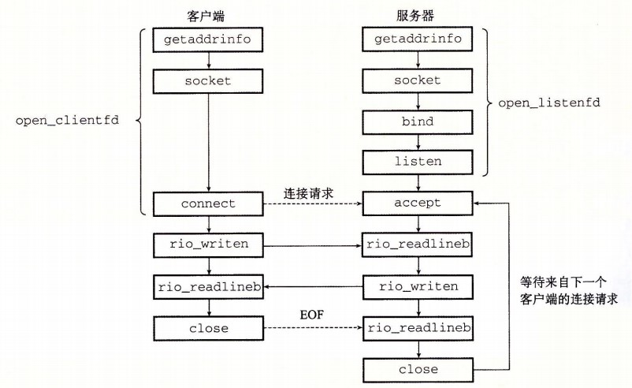

# SOCKET套接字调研

    套接字接口(socket interface)是一组函数，它们和Unix I/O函数结合起来，用以创建网络应用。

### 1、Socket的整体使用流程

下图表示的是用socket接口实现了典型的CS事务的具体调用流程。



#### 1.1、socket基本结构体说明

- in_port_t表示端口号数据类型

```c++
//同网络字节顺序一致，大端序(也就是一个数据的高字节放在内存地址的低地址)
typedef uint16_t in_port_t;
```

补充知识：目前本人亲自测验大小端的代码和结果枚举如下
```c++
#include <stdio.h>
int main(){
    union{
        int n;
        char ch;
    } data;
    
    data.n = 0x00000001;  //也可以直接写作 data.n = 1;
    if(data.ch == 1){
        printf("Little-endian\n");
    }else{
        printf("Big-endian\n");
    }
    return 0;
}
```

| 硬件 | 操作系统 | 大小端 |
| ---  | ------  | -----  |
| 浪潮盒子ARMv8 Processor rev 0 (v8l) | Linux version 4.9.140-tegra | 小端 |
| 2080服务器Intel(R) Xeon(R) Silver 4110 CPU | Ubuntu 7.5.0-3ubuntu1~18.04 | 小端 |
| 本地电脑Intel(R) Core(TM) i7-9700F CPU | Windows 10 | 小端 |


- struct in_addr表示因特尔地址结构体

```c++
typedef uint32_t in_addr_t;
struct in_addr
{
    //同网络字节顺序一致，大端序(也就是一个数据的高字节放在内存地址的低地址)
    in_addr_t s_addr;
};
```


- struct sockaddr_in表示套接字地址结构体

```c++
struct sockaddr_in
{
    __SOCKADDR_COMMON (sin_);//被拓展到sa_family_t sin_family;表示协议族，总是被设置为AF_INET
    in_port_t sin_port;			/* 端口号.  */
    struct in_addr sin_addr;		/* 因特尔地址  */

    /* 补齐到struct sockaddr的占位大小。以保持跟sockaddr大小一致.  */
    unsigned char sin_zero[sizeof (struct sockaddr) -
                __SOCKADDR_COMMON_SIZE -
                sizeof (in_port_t) -
                sizeof (struct in_addr)];
};
```

#### 1.2、socket函数详解

- socket函数(客户端和服务端)

```c++
/* 
若成功则返回非负的文件描述符；否则出错返回-1
此时，返回的文件描述符仅是部分打开，还不能用于读写。
需要进行后续的操作才能够进行打开套接字
*/
int socket (int __domain, int __type, int __protocol);
/*常用的传参都是如下所示的例子
AF_INET:表示我们正在使用32位IP地址
SOCK_STREAM:表示该socket套接字是连接的一个端点
*/
struct scokaddr_in sockfd = socket(AF_INET , SOCK_STREAM , 0);

```

- connect函数(客户端,阻塞)

```c++

/*
在套接字__fd上与一个地址为__addr的服务器建立一个因特网连接。该函数会阻塞，一直到连接成功建立
或者是发生错误；成功后，__fd描述符就准备好可以进行读写操作了，并且得到连接的套接字对如下所示：
(客户端的IP地址:客户端的临时端口，__addr.sin_addr:__addr.sin_port)。
左边唯一确定了客户端主机上的socket连接端点
*/
//__CONST_SOCKADDR_ARG被拓展为const struct sockaddr *
int connect (int __fd, __CONST_SOCKADDR_ARG __addr, socklen_t __len);

```

- bind函数(服务器)

```c++
/* 
在服务器进程上把__addr中的端口和地址绑定在__fd描述符上，用来和客户端建立连接。
*/
int bind (int __fd, __CONST_SOCKADDR_ARG __addr, socklen_t __len);
```

- listen函数(服务器)

```c++
/* 
socket函数创建的sockfd对应于主动套接字。
该函数将sockfd从一个主动套接字（即__fd)转化成为一个监听套接字；
返回了0表示成功，返回-1表示失败。
*/
int listen (int __fd, int __n);
```

- accept函数(服务器,阻塞)

```c++
/*
 服务器等待来自客户端的连接请求到达侦听描述__fd，然后在__addr中填写客户端的套接字地址i，
 并返回一个已连接描述符，这个描述符可被用来利用Unix I/O函数与客户端通信。
 accept函数与connect函数通过三次握手信息连接成功。
*/
int accept (int __fd, __SOCKADDR_ARG __addr,
		   socklen_t *__restrict __addr_len);
```

注意点：区分了监听描述符和已连接描述符的作用是提供了服务器通过一个监听描述符去连接多个已连接描述符的能力，提供了并发连接的能力。


### 2、Socket的通信实例

#### 2.1、服务端的通信实例

```c++
/*
 * server.c为服务器端代码
*/

#include "config.h"

int add_info(char* buf, int n){
	char* addinfo = "sb";
	if (n + 1 + strlen(addinfo) <= MAX_LINE){
		for(size_t i = 0; i < strlen(addinfo); i++){
			buf[n + i] = addinfo[i];
		}
		buf[n + strlen(addinfo)] = 0;
		return n + strlen(addinfo);
	}
	return n;
}

void printbuff(char* buf, int n){
	printf("n=%d, s=%s\n", n, buf);
	return 0;
}

int main(int argc , char **argv)
{
	/*声明服务器地址和客户链接地址*/
	struct sockaddr_in servaddr , cliaddr;

	/*声明服务器监听套接字和客户端链接套接字*/
	int listenfd , connfd;
	pid_t childpid;

	/*声明缓冲区*/
	char buf[MAX_LINE];

	socklen_t clilen;

	/*(1) 初始化监听套接字listenfd*/
	if((listenfd = socket(AF_INET , SOCK_STREAM , 0)) < 0)
	{
		perror("socket error");
		exit(1);
	}//if

	/*(2) 设置服务器sockaddr_in结构*/
	bzero(&servaddr , sizeof(servaddr));

	servaddr.sin_family = AF_INET;
	servaddr.sin_addr.s_addr = htonl(INADDR_ANY); //表明可接受任意IP地址
	servaddr.sin_port = htons(PORT);

	/*(3) 绑定套接字和端口*/
	if(bind(listenfd , (struct sockaddr*)&servaddr , sizeof(servaddr)) < 0)
	{
		perror("bind error");
		exit(1);
	}//if

	/*(4) 监听客户请求*/
	if(listen(listenfd , LISTENQ) < 0)
	{
		perror("listen error");
		exit(1);
	}//if

	/*(5) 接受客户请求*/
	for( ; ; )
	{
		clilen = sizeof(cliaddr);
		if((connfd = accept(listenfd , (struct sockaddr *)&cliaddr , &clilen)) < 0 )
		{
			perror("accept error");
			exit(1);
		}//if
		//打印cliaddr的信息
		printaddr(cliaddr);

		//新建子进程单独处理链接
		if((childpid = fork()) == 0) 
		{
			close(listenfd);
			//str_echo
			ssize_t n;
			char buff[MAX_LINE];
			while((n = read(connfd , buff , MAX_LINE)) > 0)
			{
				n = add_info(buff, n);
				printbuff(buff, n);
				write(connfd , buff , n);
			}
			exit(0);
		}//if
		close(connfd);
	}//for
	
	/*(6) 关闭监听套接字*/
	close(listenfd);
}

```

#### 2.2、客户端的通信实例

```c++
/*
 * client.c为客户端代码
*/

#include "config.h"

/*readline函数实现*/
ssize_t readline(int fd, char *vptr, size_t maxlen)
{
	ssize_t	n, rc;
	char	c, *ptr;

	ptr = vptr;
	for (n = 1; n < maxlen; n++) {
		if ( (rc = read(fd, &c,1)) == 1) {
			*ptr++ = c;
			if (c == '\n')
				break;	/* newline is stored, like fgets() */
		} else if (rc == 0) {
			*ptr = 0;
			return(n - 1);	/* EOF, n - 1 bytes were read */
		} else
			return(-1);		/* error, errno set by read() */
	}

	*ptr = 0;	/* null terminate like fgets() */
	return(n);
}


int main(int argc , char ** argv)
{
	/*声明套接字和链接服务器地址*/
	int sockfd;
	struct sockaddr_in servaddr;

	/*判断是否为合法输入*/
	if(argc != 2)
	{
		perror("usage:tcpcli <IPaddress>");
		exit(1);
	}//if

	/*(1) 创建套接字*/
	if((sockfd = socket(AF_INET , SOCK_STREAM , 0)) == -1)
	{
		perror("socket error");
		exit(1);
	}//if

	/*(2) 设置链接服务器地址结构*/
	bzero(&servaddr , sizeof(servaddr));
	servaddr.sin_family = AF_INET;
	servaddr.sin_port = htons(PORT);
	if(inet_pton(AF_INET , argv[1] , &servaddr.sin_addr) < 0)
	{
		printf("inet_pton error for %s\n",argv[1]);
		exit(1);
	}//if

	/*(3) 发送链接服务器请求*/
	if( connect(sockfd , (struct sockaddr *)&servaddr , sizeof(servaddr)) < 0)
	{
		perror("connect error");
		exit(1);
	}//if

	/*(4) 消息处理*/
	char sendline[MAX_LINE] , recvline[MAX_LINE];
	while(fgets(sendline , MAX_LINE , stdin) != NULL)	
	{
		write(sockfd , sendline , strlen(sendline));

		if(readline(sockfd , recvline , MAX_LINE) == 0)
		{
			perror("server terminated prematurely");
			exit(1);
		}//if

		if(fputs(recvline , stdout) == EOF)
		{
			perror("fputs error");
			exit(1);
		}//if
	}//while

	/*(5) 关闭套接字*/
	close(sockfd);
}

```

### 3、编译运行方法

#### 3.1、编译命令
```bash
#克隆项目
git clone https://github.com/pengzhikang/UnixNetLearning.git
cd tcp_socket
chmod +x run.sh
```

#### 3.2、运行演示
- 终端1输入如下命令
```
cd bin
./tcpser
```
- 终端2输入如下命令
```
cd bin
./tcpcli 127.0.1.1
```
- 通信测试
在刚才的终端2中继续输入随意的一行文字
```
输入>123123
返回信息<sb123123
```